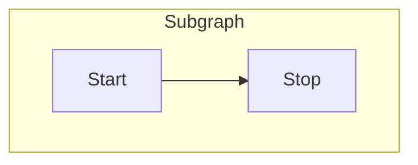
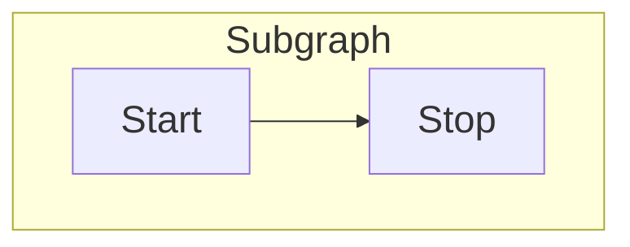
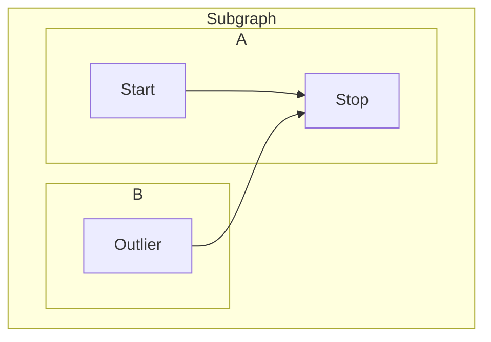
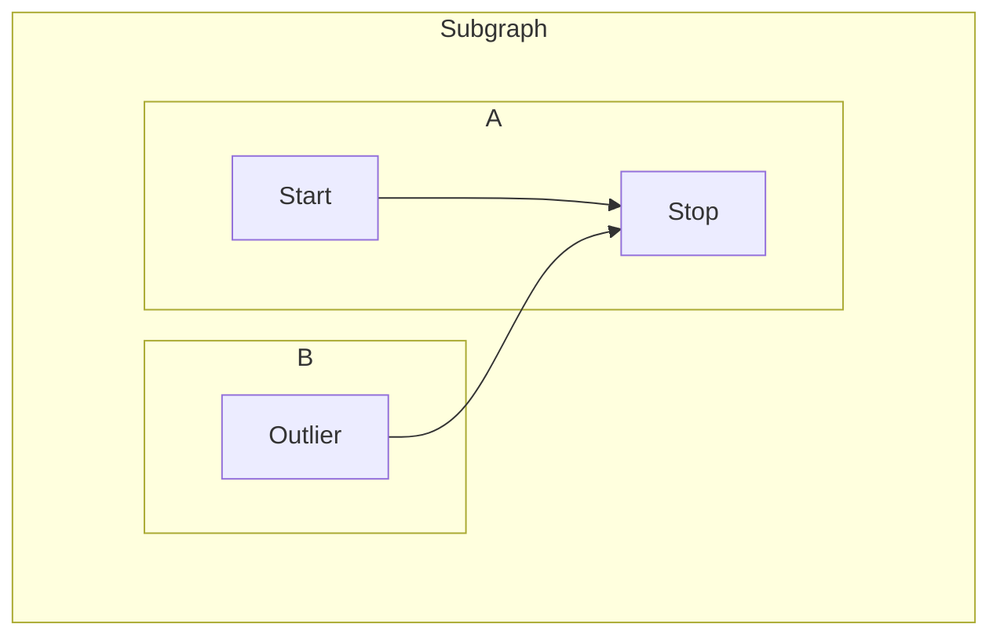

## Summary

This page outlines visual styling workarounds with Mermaid.

## Flowchart Font Size

Change the font size of Flowchart content. Note that the Mermaid client or other renderings may not strictly obey the changed font-sizes, sometimes resulting in unchanged image exports.

_Original (small font)_

_Updated with Font Size Adjusted_

## Flowchart Subgraph Padding or Margin

Add padding or margin within subgraphs for readability or design aesthetic improvements.

_Original (subgraph readability challenges)_

_Updated with Padding or Margin Added_

