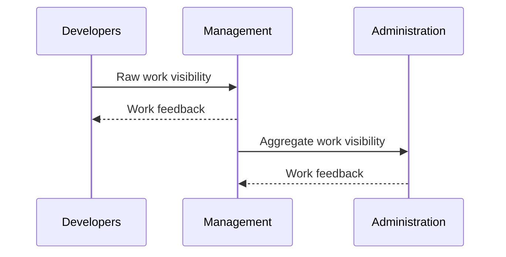
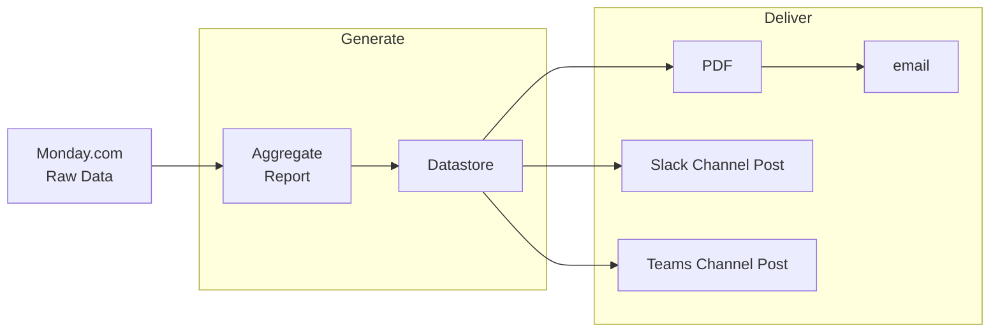
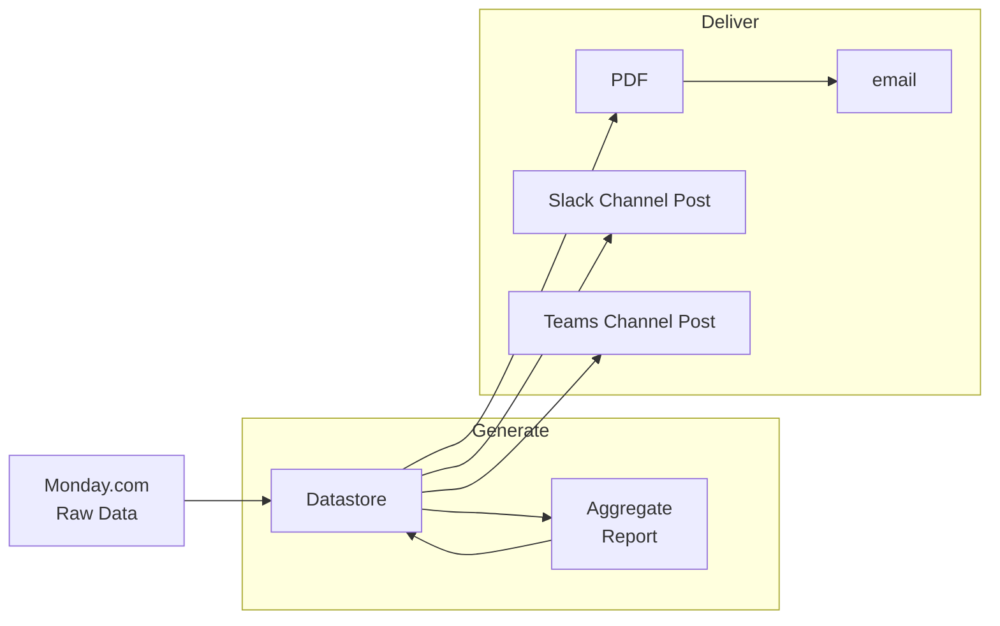

## Background

_General sequence of work visibility._

This document intends to cover solution(s) for work visibility related to the Center for Health AI's (CHAI) projects and internal initiatives. Monday.com is used as a project tracking source, Github is used as the primary source control vehicle. Project work may come in the form of internal continuous improvements, grant-related projects, or other needs CU Anschutz School of Medicine may have.

## Challenge

Monday.com is used as the primary means of work accounting and collaborations but is limited in it's ability to provide administrative visibility. This leads to manual work in creating reports, visualizations, and communications to others where an otherwise automatic solution could be used.

## Porposed Solution(s)

- Each arrow in the diagrams below is roughly equivalent to one "workflow" or ETL job which is either triggered or scheduled on a regular basis as needed.
- "Datastore" as seen in the diagrams may be well-suited for object storage with query engine layered above it for utility in downstream deliveries.

### Proposed Flow 1

_Assumes data is usable or is not needed for archival from Monday.com source._

- Report is generated from raw data and store in CHAI datastore.
- Report is then sent as Slack, MS Teams posts.
- Report is also stored in a PDF and sent in an email.

### Proposed Flow 2

_Assumes data is not usable or is needed for archival from Monday.com source._

- Monday.com raw data is stored in CHAI datastore.
- Report is generated from raw data and store in CHAI datastore.
- Report is then sent as Slack, MS Teams posts.
- Report is also stored in a PDF and sent in an email.
