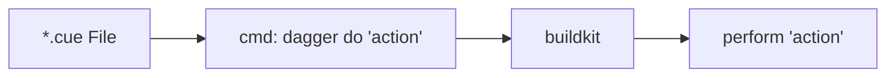
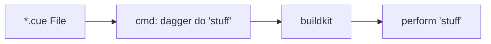

<!-- slide -->

# Dagger

### <span style="color:#aaa; text-align:center;">Portable Development <br> with Cuelang</span>

<!-- slide -->

## Intro

<br>

[Dagger](https://github.com/dagger/dagger) is a portable development tool implemented through [Cuelang](https://github.com/cue-lang/cue).
<br>



<!-- slide -->

## What's Cuelang?

> <span style="text-align:left;float:left;"> CUE is an open-source data validation language and inference engine with ... many applications, such as data __validation__, data __templating__, __configuration__, __querying__, __code generation__ and even __scripting__."</span>

[https://cuelang.org/docs/about/](https://cuelang.org/docs/about/)

<!-- slide -->

## What's Cuelang?

Data values and schema together 😮
<table>
<tr>
<td>

```json
// JSON
// values
{ 
  "denver": {
    "name": "Denver",
    "state": "CO",
    "pop": 760049,
    "capital": true
  }
}
```

</td>
<td>

```json
// CUE
// values, schema, and more
bigCity: {
    // type
    name: string
    // default value
    state: string | *"CO"
    // operators, shorthand
    pop: >700K
    // value
    capital: true
}
```

</td>
</tr>
</table>

<!-- slide -->

### Cuelang probably deserves <br> it's own conversation! 🙂

<!-- slide -->

## What's Dagger?

<br>

1. Build a .cue file
1. Use dagger client to implement (wherever)
1. Dagger uses [buildkit](https://github.com/moby/buildkit) to perform action
<br>



<!-- slide -->

## Example Usecase

1. Build a repo .cue file for testing
1. __Test locally__ with dagger client
1. __Test remotely__ with [Github Action](https://github.com/dagger/dagger-for-github) (running the same file)
1. __Celebrate__ 🥳 <br>(because there weren't surprises with local vs remote testing!)

<!-- slide -->

## Installation: __Dagger Cli__

- macOS: `brew` or `curl + shell`
- Windows: `psl`, `choco`, or `scoop`
- Linux: `curl + shell`

<https://docs.dagger.io/install>

<!-- slide -->

## Installation: __Buildkit__

Dagger needs a place to invoke buildkit.

- __Docker Desktop__ (built-in compatibility)
- __Podman__ (some pre-config)
- __Kubernetes__ (some pre-config)
- __Remotes__ (BYO remote environment)

<https://docs.dagger.io/1223/custom-buildkit/>

<!-- slide -->

## Demo

[Link here]()
