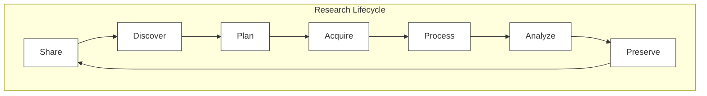

## Summary

_Rough sketch of research lifecycle based on below references._

This page provides notes surrounding the "Research Lifecycle" as a heuristic model for working through research projects.

> The Research Lifecycle is a heuristic model for understanding the steps of the process of scientific discovery (research), often represented in a wheel to emphasize the continuous nature of research with one project leading into the next.
([https://nnlm.gov/guides/data-glossary/research-lifecycle](https://nnlm.gov/guides/data-glossary/research-lifecycle))

Intepretations of the Research Lifecycle vary in their steps. Below are some references from various groups and institutions.

## References

- NNLM Research Lifecycle Definition - <https://nnlm.gov/guides/data-glossary/research-lifecycle>
- The Research Lifecycle (CU Boulder) - <https://www.colorado.edu/crdds/what-we-do/research-lifecycle>
- Research Lifecycle (The Open University) - <https://www.open.ac.uk/research/support/lifecycle>
- Research Lifecycle (Amsterdam UMC) - <https://aph-qualityhandbook.org/research-lifecycle/>
- Research Management Lifecycle (University of Washington) - <https://spaces.at.internet2.edu/download/attachments/30966076/Research%20Management%20LifeCycle%20%28from%20Jason%20Myers%202014-06-02%29.pdf?api=v2>

## Related

- Kaizen, continuous improvement - <https://en.wikipedia.org/wiki/Kaizen>
  - While different in focus, kaizen procedures have many similarities which may be beneficial to consider in context with the research lifecycle, such as PDCA loops, etc.
