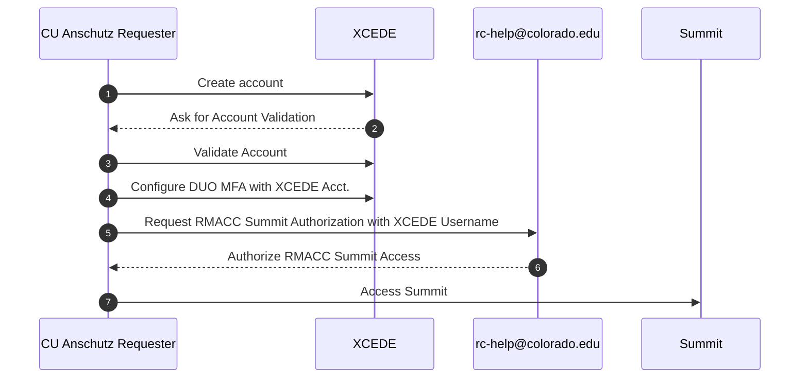

## Summary

Research Computing (RC) through the University of Colorado Boulder (CU Boulder) provides a supercomputer resource called __Summit__. For more information see the following webpage: <https://colorado.edu/rc/resources/summit>.

## CU Anschutz Access

Those with University of Colorado Anschutz (CU Anschutz) may access the Summit supercomputing resource using an [XCEDE account](https://portal.xsede.org/) and configuration help from RC at UCB via the following email: [rc-help@colorado.edu](mailto:rc-help@colorado.edu).

Use the following guide for more information:
<https://curc.readthedocs.io/en/latest/access/rmacc.html>

Generally, the access sequence is as follows:

