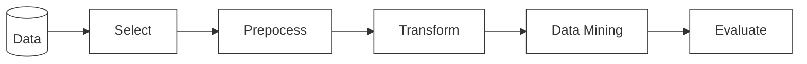

## Summary

[Knowledge discovery in databases (KDD)](https://www.kdnuggets.com/gpspubs/aimag-kdd-overview-1996-Fayyad.pdf) is a [data mining](https://en.wikipedia.org/wiki/Data_mining) model with specific steps and interpretations. The above chart shows the general steps of this procedure.

## References

- From Data Mining to Knowledge Discovery in Databases - <https://www.kdnuggets.com/gpspubs/aimag-kdd-overview-1996-Fayyad.pdf>
- Wikipedia Page on Data Mining - <https://en.wikipedia.org/wiki/Data_mining>
- Related ACM Special Interest Group for KDD - <https://en.wikipedia.org/wiki/Special_Interest_Group_on_Knowledge_Discovery_and_Data_Mining>
